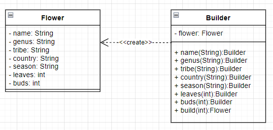

# Patterns

## <ins>Behavior</ins>

### Chain of responsibility

A chain of responsibility is a behavioral design pattern that allows you to pass requests 
sequentially through a chain of handlers. Each subsequent handler decides whether it can 
process the request itself and whether it is worth passing the request further along the chain.

### Iterator

An iterator is a behavioral design pattern that makes it possible to sequentially traverse the 
elements of compound objects without exposing their internal representation.

## <ins>Creational</ins>

### Builder

The builder is a generative design pattern that allows you to create complex objects step by
step. The builder makes it possible to use the same construction code to obtain different 
representations of objects.

### Factory

A factory method is a generic design pattern that defines a common interface for creating objects
in a superclass, allowing subclasses to change the type of objects they create.

## <ins>Structural</ins>

### Bridge

A bridge is a structural design pattern that separates one or more classes into two separate
hierarchies, an abstraction and an implementation, allowing them to be modified independently.

### Decorator

A decorator is a structural design pattern that allows you to dynamically add new functionality 
to objects by wrapping them in useful wrappers.

